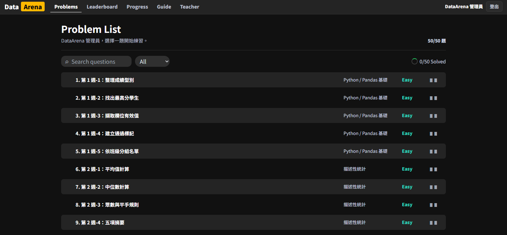
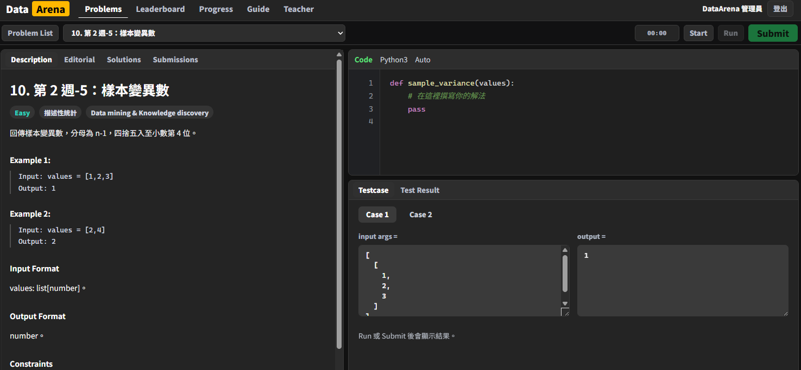

# DataArena

DataArena 是一個 LeetCode 風格的 Python 題目練習平台。學生可以登入、選題、開始限時作答、執行公開範例測資、正式 Submit；老師可以開放/關閉題目，也可以在後台上傳新題目與測資。


## 預設帳號

老師帳號：

- Email: `admin@dataarena.local`
- Password: `DataArena@2026!`

範例學生帳號：

- Email: `student@dataarena.local`
- Password: `Student@2026!`
- Student ID: `SAMPLE001`

## 啟動

```bash
corepack pnpm install
corepack pnpm build
corepack pnpm start
```

預設網址：`http://localhost:8080`

開發模式：

```bash
corepack pnpm dev
corepack pnpm dev:api
```

如果前端與 API 分開跑，請設定：

```bash
$env:VITE_API_BASE_URL="http://localhost:8080"
```

重建資料庫與 seed：

```bash
corepack pnpm reset-db
```

## 老師如何開放/關閉題目

1. 使用老師帳號登入。
2. 進入「老師後台」。
3. 在「題目管理」分頁中，每題都有「關閉題目」或「開放題目」按鈕。
4. 預設所有 seed 題目與新上傳題目都是開放。
5. 題目被關閉後，學生的 Problem List、題目詳情、Progress 與 Leaderboard 都不會再使用該題。
6. 老師仍可在後台看到關閉題目，並可重新開放。

## 老師如何上傳題目

1. 登入老師帳號。
2. 進入「老師後台」。
3. 切換到「上傳題目」分頁。
4. 可先按「載入 Two Sum 範例」查看完整格式。
5. 填寫題目基本資料、函式名稱、參數、題目敘述、Starter Code 與測資 JSON。
6. 按「上傳題目」。
7. 上傳後建議到 Problem List 選新題目，用老師帳號 Start、Run、Submit 一次，確認 public 與 hidden 測資都正確。

## 欄位說明

- `Slug`: 題目網址識別字，例如 `two-sum-demo`。可留空讓系統根據標題產生。
- `週次`: 題目所屬週次，必須是 1 到 99。
- `單元名稱`: 顯示用分類，例如 `Array Warmup`。
- `題目標題`: 顯示給學生的題名。
- `難度`: Easy、Medium、Hard，分別對應 1、2、3。
- `分類`: 題目標籤，例如 `Array / Hash Table`。
- `時間限制秒數`: 作答倒數時間，60 到 7200 秒。
- `函式名稱`: 學生必須實作的 Python 函式名稱，例如 `two_sum`。
- `參數 signature`: 以逗號分隔，例如 `nums, target`。
- `Starter Code / 範例 func`: 學生編輯器預設載入的 Python 程式。
- `測資 JSON`: public 與 hidden 測資陣列。
- `上傳後立即開放給學生`: 預設勾選；取消後學生不會看到該題。

## Starter Code 範例

```python
def two_sum(nums, target):
    seen = {}
    for index, value in enumerate(nums):
        need = target - value
        if need in seen:
            return [seen[need], index]
        seen[value] = index
    return []
```

最小可用模板：

```python
def two_sum(nums, target):
    # TODO: write your solution
    pass
```

函式名稱必須和「函式名稱」欄位一致；參數也要和 signature 一致。

## 測資 JSON 寫法

測資最外層必須是陣列。每筆測資需要：

- `name`: 測資名稱。
- `visibility`: `public` 或 `hidden`。
- `args`: 傳給函式的參數陣列。
- `expected`: 預期回傳值。
- `comparator`: `exact`、`number` 或 `deepNumber`。

範例：

```json
[
  {
    "name": "Sample 1",
    "visibility": "public",
    "args": [[2, 7, 11, 15], 9],
    "expected": [0, 1],
    "comparator": "exact"
  },
  {
    "name": "Hidden 1",
    "visibility": "hidden",
    "args": [[3, 3], 6],
    "expected": [0, 1],
    "comparator": "exact"
  }
]
```

重點：`args` 是外層參數陣列。若函式是：

```python
def two_sum(nums, target):
    ...
```

那系統會執行：

```python
two_sum(*args)
```

所以 `args` 要寫成：

```json
[[2, 7, 11, 15], 9]
```

不是：

```json
{"nums": [2, 7, 11, 15], "target": 9}
```

## Comparator 說明

- `exact`: 用 `JSON.stringify` 後的結構比較，適合字串、整數、陣列、dict。
- `number`: 適合單一浮點數，允許 `0.0001` 誤差。
- `deepNumber`: 適合陣列或 dict 裡面含浮點數，也允許 `0.0001` 誤差。

## Hidden 測資

`hidden` 測資只會在正式 Submit 時執行。學生只會看到該 hidden case 是否通過與錯誤訊息，不會看到 hidden 的 input、expected 或 actual。

## Docker

```bash
docker compose up --build
```

Docker 預設也使用 `http://localhost:8080`，SQLite 資料放在 volume `data-arena-data`。
